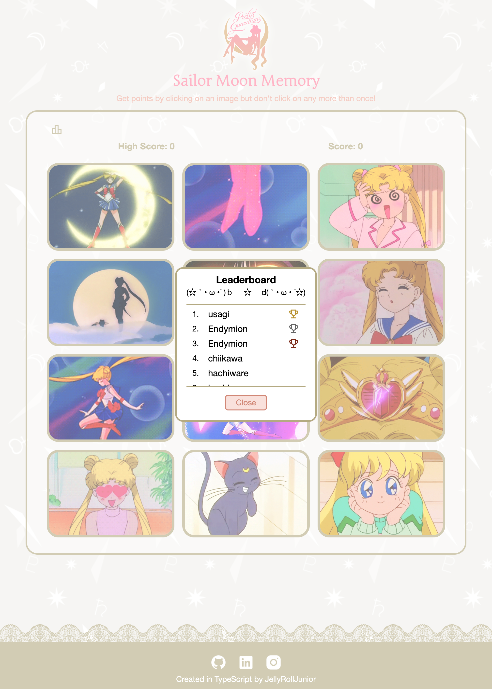
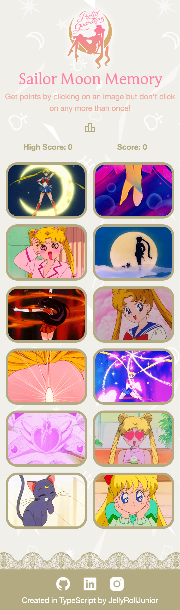

<h1 align="center">Sailor Moon Memory (TS Version)</h1>
<h3 align="center">Play a Sailor Moon themed game of memory <a href='https://sailor-moon-memory.netlify.app/'>here</a>!</h3>
<p align="center">
    
</p>

## Features

- Memory Game with animated cards
    - click each tile exactly once to win
    - click a tile two times and you lose
    - clicking a card shuffles the cards
- Memory cards
    - loading animation
    - error loading / broken link design
- Scoreboard & highscore count
- Leaderboard
    - fetch winners
    - post your name on leaderboard
- Refresh button on error loading gifs for memory cards
- Error page on invalid routes / unexexpected errors
- A really neat loading animation!

## Stack

- Client
    - React, Typescript, Vite
    - React router, Zod, Vitest
    - TailwindCSS, Motion
- Server
    - Express, NodeJS, Typescript
    - PrismaORM
    - CORS, Zod, Vitest, Supertest
- Shared
    - Typescript

## App Showcase

| Desktop                                         | Leaderboard                                         |
| ----------------------------------------------- | --------------------------------------------------- |
|  |  |

| Mobile                                         | Loading Animation                               |
| ---------------------------------------------- | ----------------------------------------------- |
|  |  |

## Endpoints

| Method | URI      | Function         | Body (inputs)             | Outputs                    | Notes |
| ------ | -------- | ---------------- | ------------------------- | -------------------------- | ----- |
| GET    | /winners | Retrieve winners |                           | [...winners]               |       |
| POST   | /winners | Create winner    | name: { min: 1, max: 16 } | winner: { name, datetime } |       |

## Learning outcomes

- Architecture
    - Configure Monorepo with client / server / shared packages
    - Shared for types, DTOs, enums, constants
    - Configure base tsconfig for each pacakge to use
    - Using feature folders vs controller/router/server folder etc.
        - Feature folders let you work on one problem at a time without fighting the filesystem
    - Using contract tests in server to enforce type parity between server and shared
- Client
    - First TS project
    - Typing in JS
    - Typing React component props
    - Extending types with `&`
    - Generic function return types
        - returning an array with contents shuffled
    - Type narrowing function
    - Typescript forward refs
    - Styling dialog backdrop with tailwind
    - ZOD
        - creating primitive schema
        - creating object schema
        - parsing api responses with ZOD
        - parsing api error response with ZOD
        - ZOD default / catch values
        - ZOD transform to modify shape of response object
        - ZOD infer type using schema
    - Structuring project for scale
        - barrel file pattern: export file for each component
        - /components for shared UI elements
        - /features for domain UI
        - /layout for page layouts + page layout components
        - /pages for navigatable pages
    - Configuring path aliases
        - modify tsconfig.app.json & vite.config.ts
    - Vitest
        - Using Vitest with Typescript
        - revisting testing with React
            - mocking functions
            - mocking components
            - userEvent to click elements
            - snapshot tests
            - mocking default imports & libraries!
    - Separating components with multiple responsibilities into container + view
        - container for fetching data, state ownership, calling domain logic
        - view for rendering UI and handling callback ONLY
        - promotes UI testability
            - when they were 1 component, I had to mock hooks/state/game logic/etc. Now I don't!
- Server
    - Learned I don't need to load dotenv more than once (oops!)
        - Learned I can import 'dotenv/config' instead of import 'dotenv' (wow!)
    - Moving prisma config & folders out of src for cleaner project structure
    - Typing / Extending classes in TS
    - Typing express middleware
        - Typing request body
    - Validating request body input with ZOD
    - "Moving all business logic into services" model
        - controllers are for receiving inputs & delegating to services with business logic, then responding
    - Denoting intentionally unused params in express middleware
    - Testing routes in TS
        - configuring path aliasing in Vitest tests
        - mocking function return values dynamically
    - Using mappers to map DB object to Data Transfer Object (DTO)
    - Validating DTO before sending response
    - DTO mappers for ServerErrors and ValidationErrors
    - Contract tests to ensure serverWinnerDTO type matches sharedWinnerDTO type
    - Tests with typechecking!
- General
    - Build and run prod every once in a while (saves headache of fixing build at the end)

## Improvements vs [Original](https://github.com/JellyRollJunior/sailor-moon-memory) in React-JS

- Game tiles
    - loading animation when loading gifs
    - error dead gif animation
- Modal on losing
- Cheat mode (highlights clicked tiles)
- Refresh button to refetch gifs on error loading gifs
- Architect a more scalable project file structure (feature folders / monorepo )
- Configure path aliasing to simplify imports
- Site icons
- Leaderboard
    - Backend to save leaderboard values
- Tests for entire suite (server and client)!

## Retrospective aka yapping

Learned A LOT in this project. First time working with TS, ZOD, feature folders, container / view component structure, mappers, DTOs, and monorepo shared folder. I'm still not confident with TS but I am comfortable putting it on my resume now! I also revisited testing; I learned how to mock default imports in Vitest :)

## Environment variables

### ./client/.env

```bash
VITE_SERVER_BASE_URL
VITE_GIPHY_API_KEY
```

### ./server/.env

```bash
PORT
CORS_ORIGINS=URL_1, URL_2, URL_3 ...

# Database
DATABASE_URL
```

## Start commands

```bash
# Start backend server
cd packages/server
npm install

# prod build
npm run build
npm run start
# dev
npm run dev
```

```bash
# Start frontend react
cd packages/client
npm install

# prod build
npm install
npm run build
npm run preview
# dev
npm run dev
```

## Yapping (2)

```ts
// I wrote a cool generic that removes the ID key from an object
// Took me a long time to figure this out in TS! First challenging TS generic usage
// Didn't end up using it in the final build so documenting here for me 8)
const omitId = <T extends { id: unknown }>(input: T): Omit<T, "id"> => {
    const { id, ...filtered } = input;
    return filtered;
};
```

## Acknowledgements

| Usage   | Source                                           |
| ------- | ------------------------------------------------ |
| Artwork | Naoko Takeuchi                                   |
| Assets  | [Pretty Guardians](https://prettyguardians.com/) |
| Gifs    | [Giphy](https://giphy.com/)                      |
